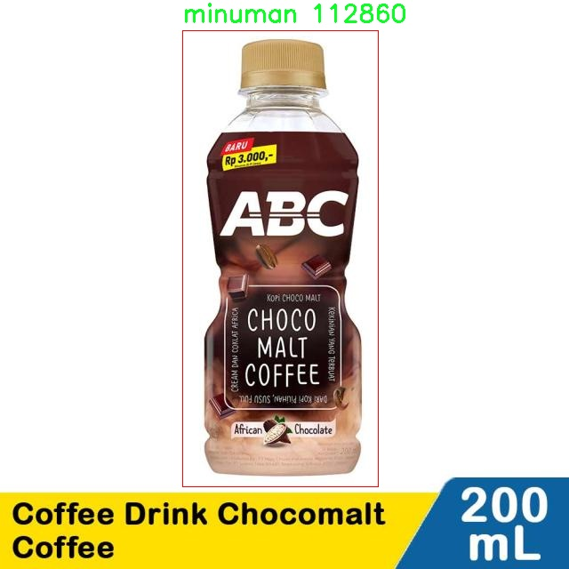

# 食品分类2检测检测系统源码分享
 # [一条龙教学YOLOV8标注好的数据集一键训练_70+全套改进创新点发刊_Web前端展示]

### 1.研究背景与意义

项目参考[AAAI Association for the Advancement of Artificial Intelligence](https://gitee.com/qunshansj/projects)

项目来源[AACV Association for the Advancement of Computer Vision](https://gitee.com/qunmasj/projects)

研究背景与意义

随着全球人口的不断增长和生活水平的提高，食品安全与营养健康问题日益受到关注。食品种类繁多，消费者在选择食品时不仅关注其营养成分，还对食品的来源、品质和安全性提出了更高的要求。在此背景下，食品分类与检测技术的研究显得尤为重要。尤其是在快速发展的人工智能领域，基于深度学习的图像识别技术为食品分类提供了新的解决方案。YOLO（You Only Look Once）系列模型因其高效的实时检测能力，已成为目标检测领域的重要工具。

本研究旨在基于改进的YOLOv8模型，构建一个高效的食品分类与检测系统。我们使用的数据集“dataset-gizilo”包含1900张图像，涵盖了两大类食品：makanan（食品）和minuman（饮料）。尽管数据集的规模相对较小，但其多样性和代表性为模型的训练提供了良好的基础。通过对YOLOv8模型的改进，我们期望能够提升模型在小样本数据集上的表现，进而实现更高的分类准确率和检测效率。

食品分类与检测系统的意义不仅体现在技术层面，更在于其广泛的应用前景。首先，该系统能够为食品生产企业提供实时的质量监控，帮助企业在生产过程中及时发现和纠正问题，确保食品安全。其次，消费者在日常生活中也可以借助该系统快速识别食品的种类和成分，从而做出更为科学的饮食选择。此外，随着电子商务的迅猛发展，食品在线销售的普及也对食品分类与检测提出了新的需求。基于YOLOv8的食品分类系统可以有效支持电商平台对商品的自动化管理，提高商品上架和搜索的效率。

在技术创新方面，YOLOv8作为最新一代的目标检测模型，具备更强的特征提取能力和更快的推理速度。通过对模型架构的优化和参数的调整，我们可以在保证检测精度的同时，提升系统的响应速度。这对于需要实时反馈的应用场景尤为重要，如智能餐饮、无人超市等。通过对YOLOv8的改进，我们还可以探索其在其他领域的应用潜力，例如农业监测、环境保护等。

综上所述，基于改进YOLOv8的食品分类与检测系统不仅具有重要的学术研究价值，也为实际应用提供了有力的技术支持。通过深入研究和实践，我们希望能够为食品安全和健康饮食提供更加智能化的解决方案，为推动食品行业的数字化转型贡献力量。

### 2.图片演示


##### 注意：由于此博客编辑较早，上面“2.图片演示”和“3.视频演示”展示的系统图片或者视频可能为老版本，新版本在老版本的基础上升级如下：（实际效果以升级的新版本为准）

  （1）适配了YOLOV8的“目标检测”模型和“实例分割”模型，通过加载相应的权重（.pt）文件即可自适应加载模型。

  （2）支持“图片识别”、“视频识别”、“摄像头实时识别”三种识别模式。

  （3）支持“图片识别”、“视频识别”、“摄像头实时识别”三种识别结果保存导出，解决手动导出（容易卡顿出现爆内存）存在的问题，识别完自动保存结果并导出到tempDir中。

  （4）支持Web前端系统中的标题、背景图等自定义修改，后面提供修改教程。

  另外本项目提供训练的数据集和训练教程,暂不提供权重文件（best.pt）,需要您按照教程进行训练后实现图片演示和Web前端界面演示的效果。

### 3.视频演示

[3.1 视频演示](https://www.bilibili.com/video/BV1KJtFeMEcF/)

### 4.数据集信息展示

##### 4.1 本项目数据集详细数据（类别数＆类别名）

nc: 2
names: ['makanan', 'minuman']


##### 4.2 本项目数据集信息介绍

数据集信息展示

在本研究中，我们采用了名为“dataset-gizilo”的数据集，以支持改进YOLOv8的食品分类与检测系统的训练与评估。该数据集专注于食品领域，具体涵盖了两大类目：食物（makanan）和饮料（minuman）。通过精心构建的图像数据集，我们旨在提升YOLOv8在食品分类与检测任务中的准确性和效率。

“dataset-gizilo”数据集的类别数量为2，分别为“makanan”和“minuman”。这一分类设置不仅反映了食品领域的基本构成，也为模型的训练提供了明确的目标。食物类别（makanan）包括了多种日常食品，如米饭、面条、蔬菜、肉类等，而饮料类别（minuman）则涵盖了水、果汁、汽水等多种饮品。这种清晰的分类结构使得模型在训练过程中能够有效地学习到不同类别之间的特征差异，从而在实际应用中实现更高的分类精度。

数据集中的图像样本经过严格筛选与标注，确保了数据的多样性与代表性。每个类别下的图像不仅涵盖了不同的食品和饮料类型，还考虑了不同的拍摄角度、光照条件和背景环境。这种多样性使得模型在面对现实世界中各种复杂情况时，能够具备更强的适应能力和鲁棒性。此外，数据集还包括了多种不同的图像分辨率，以便于模型在不同计算资源条件下的灵活应用。

在数据预处理阶段，我们对图像进行了标准化处理，以确保输入数据的一致性。这包括调整图像的尺寸、归一化像素值等步骤，旨在提升模型的训练效率与收敛速度。同时，为了增强模型的泛化能力，我们还应用了数据增强技术，如随机裁剪、旋转、翻转等。这些技术不仅增加了训练样本的多样性，还有效减少了模型对特定样本的过拟合风险。

通过使用“dataset-gizilo”数据集，我们的目标是实现一个高效的食品分类与检测系统，该系统能够在实时场景中快速、准确地识别和分类食品与饮料。这一系统的潜在应用场景包括智能餐厅、食品安全监测、以及电子商务平台等，能够为用户提供更为便捷的服务体验。

总之，“dataset-gizilo”数据集为改进YOLOv8的食品分类与检测系统提供了坚实的基础。通过精心设计的类别结构和丰富的图像样本，我们期望能够推动食品分类技术的发展，为相关领域的研究与应用提供有力支持。随着研究的深入，我们相信这一数据集将为实现更高效的食品检测系统铺平道路，助力智能化食品管理的未来。





### 5.全套项目环境部署视频教程（零基础手把手教学）

[5.1 环境部署教程链接（零基础手把手教学）](https://www.ixigua.com/7404473917358506534?logTag=c807d0cbc21c0ef59de5)


[5.2 安装Python虚拟环境创建和依赖库安装视频教程链接（零基础手把手教学）](https://www.ixigua.com/7404474678003106304?logTag=1f1041108cd1f708b01a)

### 6.手把手YOLOV8训练视频教程（零基础小白有手就能学会）

[6.1 手把手YOLOV8训练视频教程（零基础小白有手就能学会）](https://www.ixigua.com/7404477157818401292?logTag=d31a2dfd1983c9668658)

### 7.70+种全套YOLOV8创新点代码加载调参视频教程（一键加载写好的改进模型的配置文件）

[7.1 70+种全套YOLOV8创新点代码加载调参视频教程（一键加载写好的改进模型的配置文件）](https://www.ixigua.com/7404478314661806627?logTag=29066f8288e3f4eea3a4)

### 8.70+种全套YOLOV8创新点原理讲解（非科班也可以轻松写刊发刊，V10版本正在科研待更新）

由于篇幅限制，每个创新点的具体原理讲解就不一一展开，具体见下列网址中的创新点对应子项目的技术原理博客网址【Blog】：


[8.1 70+种全套YOLOV8创新点原理讲解链接](https://gitee.com/qunmasj/good)

### 9.系统功能展示（检测对象为举例，实际内容以本项目数据集为准）

图9.1.系统支持检测结果表格显示

  图9.2.系统支持置信度和IOU阈值手动调节

  图9.3.系统支持自定义加载权重文件best.pt(需要你通过步骤5中训练获得)

  图9.4.系统支持摄像头实时识别

  图9.5.系统支持图片识别

  图9.6.系统支持视频识别

  图9.7.系统支持识别结果文件自动保存

  图9.8.系统支持Excel导出检测结果数据


### 10.原始YOLOV8算法原理

原始YOLOv8算法原理

YOLOv8作为目标检测领域的最新进展，继承并优化了YOLO系列算法的核心思想，特别是在YOLOv5的基础上进行了显著的改进。其设计理念旨在实现更高的检测精度和更快的推理速度，同时保持模型的轻量化特性，使其能够在资源受限的环境中高效运行。YOLOv8的架构主要由三个部分组成：骨干特征提取网络、特征融合层和检测头层，这些部分共同构成了YOLOv8的核心。

在骨干特征提取网络层，YOLOv8采用了C2F模块替代了YOLOv5中的C3模块。C2F模块的设计灵感来源于ELAN结构，通过引入更多的shortcut连接，增强了特征的重用能力，从而在保持模型轻量化的同时，提升了特征提取的效率。C2F模块通过分支结构将特征图分为两个路径，其中一个路径直接连接到特征融合层，而另一个路径则经过多个Bottleneck网络进行处理。这种设计使得模型能够在深层网络中有效缓解梯度消失的问题，并且增强了对浅层特征的利用。通过将特征的输入通道和输出通道保持一致，C2F模块能够在不同层次之间实现高效的信息流动。

特征融合层则采用了PAN-FPN结构，旨在实现多尺度特征的深度融合。YOLOv8在这一层中引入了BiFPN网络，通过高效的双向跨尺度连接和加权特征融合，进一步提升了模型对不同尺度特征信息的提取速度和准确性。BiFPN的设计理念是通过简化特征图的连接方式，减少不必要的计算，同时保留重要的特征信息，从而实现更高效的特征融合。这一过程包括自下而上的高层特征与中层特征的融合，以及自上而下的细节信息与语义信息的结合，使得每一层的特征图都能包含丰富的上下文信息。

在检测头层，YOLOv8采用了解耦头的设计，摒弃了传统的锚框机制，转而使用Anchor-Free的思想。这一创新使得模型在处理目标检测时能够更加灵活，并且在面对不同大小和形状的目标时，表现出更好的适应性。YOLOv8的检测头通过多个特征图进行边框回归和目标分类，利用Distribution Focal Loss和CIoU Loss等损失函数，确保模型在训练过程中能够有效应对样本不平衡的问题，特别是在小目标检测方面。

为了提高模型的鲁棒性和准确性，YOLOv8在数据预处理阶段采用了多种增强手段，包括马赛克增强、混合增强、空间扰动和颜色扰动等。这些增强策略不仅丰富了训练样本的多样性，还有效提升了模型对不同场景和条件下目标的检测能力。

在训练过程中，YOLOv8的样本匹配策略由静态匹配改为Task-Aligned的Assigner匹配方式，这一变化使得模型能够更智能地处理不同类别的目标，进一步提升了检测的精度和效率。YOLOv8在训练过程中还引入了动态学习率调整机制，以适应不同阶段的训练需求，从而实现更快的收敛速度和更好的最终性能。

总的来说，YOLOv8通过一系列创新的设计和优化，不仅继承了YOLO系列算法的优良传统，还在多个方面进行了突破，尤其是在模型的轻量化、特征提取的高效性以及检测精度的提升等方面，展现出了强大的潜力。随着YOLOv8的推出，目标检测技术在实际应用中的表现将更加出色，尤其是在智能监控、自动驾驶和无人机等领域，YOLOv8无疑将成为推动技术进步的重要力量。


### 11.项目核心源码讲解（再也不用担心看不懂代码逻辑）

#### 11.1 70+种YOLOv8算法改进源码大全和调试加载训练教程（非必要）\ultralytics\utils\callbacks\mlflow.py

以下是经过精简和注释的核心代码部分，主要保留了与MLflow日志记录相关的功能，并对每个部分进行了详细的中文注释：

```python
# 导入必要的库和模块
from ultralytics.utils import LOGGER, RUNS_DIR, SETTINGS, TESTS_RUNNING, colorstr

try:
    import os
    import mlflow  # 导入mlflow库用于日志记录
    from pathlib import Path

    # 确保不在测试环境中记录日志
    assert not TESTS_RUNNING or 'test_mlflow' in os.environ.get('PYTEST_CURRENT_TEST', '')
    # 确保MLflow集成已启用
    assert SETTINGS['mlflow'] is True  
    assert hasattr(mlflow, '__version__')  # 确保mlflow包已正确导入

    PREFIX = colorstr('MLflow: ')  # 设置日志前缀

except (ImportError, AssertionError):
    mlflow = None  # 如果导入失败，则mlflow为None


def on_pretrain_routine_end(trainer):
    """
    在预训练例程结束时记录训练参数到MLflow。

    Args:
        trainer (ultralytics.engine.trainer.BaseTrainer): 包含要记录的参数的训练对象。
    """
    global mlflow

    # 获取MLflow跟踪URI，默认为'runs/mlflow'
    uri = os.environ.get('MLFLOW_TRACKING_URI') or str(RUNS_DIR / 'mlflow')
    LOGGER.debug(f'{PREFIX} tracking uri: {uri}')
    mlflow.set_tracking_uri(uri)  # 设置跟踪URI

    # 设置实验和运行名称
    experiment_name = os.environ.get('MLFLOW_EXPERIMENT_NAME') or trainer.args.project or '/Shared/YOLOv8'
    run_name = os.environ.get('MLFLOW_RUN') or trainer.args.name
    mlflow.set_experiment(experiment_name)  # 设置实验名称

    mlflow.autolog()  # 启用自动日志记录
    try:
        # 开始一个新的运行或获取当前活动的运行
        active_run = mlflow.active_run() or mlflow.start_run(run_name=run_name)
        LOGGER.info(f'{PREFIX}logging run_id({active_run.info.run_id}) to {uri}')
        # 提供本地服务器的访问链接
        if Path(uri).is_dir():
            LOGGER.info(f"{PREFIX}view at http://127.0.0.1:5000 with 'mlflow server --backend-store-uri {uri}'")
        # 记录训练参数
        mlflow.log_params(dict(trainer.args))
    except Exception as e:
        LOGGER.warning(f'{PREFIX}WARNING ⚠️ Failed to initialize: {e}\n'
                       f'{PREFIX}WARNING ⚠️ Not tracking this run')


def on_fit_epoch_end(trainer):
    """在每个训练周期结束时记录训练指标到MLflow。"""
    if mlflow:
        # 清理指标名称并记录到MLflow
        sanitized_metrics = {k.replace('(', '').replace(')', ''): float(v) for k, v in trainer.metrics.items()}
        mlflow.log_metrics(metrics=sanitized_metrics, step=trainer.epoch)


def on_train_end(trainer):
    """在训练结束时记录模型工件。"""
    if mlflow:
        # 记录最佳模型的权重文件
        mlflow.log_artifact(str(trainer.best.parent))
        # 记录保存目录中的所有其他文件
        for f in trainer.save_dir.glob('*'):
            if f.suffix in {'.png', '.jpg', '.csv', '.pt', '.yaml'}:
                mlflow.log_artifact(str(f))

        mlflow.end_run()  # 结束当前运行
        LOGGER.info(f'{PREFIX}results logged to {mlflow.get_tracking_uri()}\n'
                    f"{PREFIX}disable with 'yolo settings mlflow=False'")


# 定义回调函数
callbacks = {
    'on_pretrain_routine_end': on_pretrain_routine_end,
    'on_fit_epoch_end': on_fit_epoch_end,
    'on_train_end': on_train_end} if mlflow else {}
```

### 代码说明：
1. **导入模块**：导入了必要的库，包括`mlflow`用于日志记录，`os`用于环境变量处理，`pathlib`用于路径操作。
2. **异常处理**：确保在导入`mlflow`时不会出现错误，并在测试环境中不记录日志。
3. **`on_pretrain_routine_end`函数**：在预训练结束时记录训练参数，设置实验和运行名称，并开始MLflow运行。
4. **`on_fit_epoch_end`函数**：在每个训练周期结束时记录训练指标。
5. **`on_train_end`函数**：在训练结束时记录模型工件（如权重文件和其他文件）。
6. **回调函数**：根据是否成功导入`mlflow`来定义回调函数。

以上代码是MLflow与Ultralytics YOLO集成的核心部分，负责记录训练过程中的重要信息。

这个文件是一个用于Ultralytics YOLO模型的MLflow日志记录模块。MLflow是一个开源平台，用于管理机器学习生命周期，包括实验跟踪、模型管理和部署等功能。该模块的主要作用是记录训练过程中的参数、指标和模型工件，以便后续分析和可视化。

文件开头部分包含了一些基本信息和使用说明，介绍了如何设置项目名称、运行名称，以及如何启动本地的MLflow服务器。用户可以通过环境变量或命令行参数来配置这些设置。默认情况下，MLflow服务器会在本地的5000端口运行，用户可以通过指定不同的URI来改变存储位置。

接下来的代码导入了一些必要的模块和库，包括Ultralytics的日志记录器、运行目录、设置和颜色字符串。然后，代码尝试导入os模块，并进行一些断言检查，以确保在测试运行时不记录日志，并验证MLflow集成是否启用。

在定义的几个函数中，`on_pretrain_routine_end`函数用于在预训练过程结束时记录训练参数。它根据环境变量和训练器的参数设置MLflow的跟踪URI、实验名称和运行名称，并启动MLflow运行。随后，它会记录训练器的参数。

`on_fit_epoch_end`函数则在每个训练周期结束时记录训练指标。它会清理指标的键名，去掉括号，并将这些指标记录到MLflow中。

`on_train_end`函数在训练结束时记录模型工件。它会记录最佳模型和其他文件（如图像、CSV、权重和配置文件等），并结束当前的MLflow运行。

最后，代码定义了一个回调字典，将上述函数与特定的训练过程阶段关联起来，只有在成功导入MLflow的情况下才会执行这些回调。这使得用户可以在训练过程中灵活地记录和管理实验数据。

总体而言，这个模块为Ultralytics YOLO模型提供了强大的日志记录功能，帮助用户更好地管理和分析他们的机器学习实验。

#### 11.2 70+种YOLOv8算法改进源码大全和调试加载训练教程（非必要）\ultralytics\nn\extra_modules\ops_dcnv3\setup.py

以下是代码中最核心的部分，并附上详细的中文注释：

```python
import os
import glob
import torch
from torch.utils.cpp_extension import CUDA_HOME, CppExtension, CUDAExtension
from setuptools import find_packages, setup

# 定义依赖包
requirements = ["torch", "torchvision"]

def get_extensions():
    # 获取当前文件的目录
    this_dir = os.path.dirname(os.path.abspath(__file__))
    # 定义扩展源代码的目录
    extensions_dir = os.path.join(this_dir, "src")

    # 查找主文件和CPU/CUDA源文件
    main_file = glob.glob(os.path.join(extensions_dir, "*.cpp"))
    source_cpu = glob.glob(os.path.join(extensions_dir, "cpu", "*.cpp"))
    source_cuda = glob.glob(os.path.join(extensions_dir, "cuda", "*.cu"))

    # 合并所有源文件
    sources = main_file + source_cpu
    extension = CppExtension  # 默认使用 CppExtension
    extra_compile_args = {"cxx": []}  # 编译参数
    define_macros = []  # 宏定义

    # 检查是否可以使用CUDA
    if torch.cuda.is_available() and CUDA_HOME is not None:
        extension = CUDAExtension  # 使用 CUDAExtension
        sources += source_cuda  # 添加CUDA源文件
        define_macros += [("WITH_CUDA", None)]  # 定义WITH_CUDA宏
        extra_compile_args["nvcc"] = []  # CUDA编译参数
    else:
        raise NotImplementedError('Cuda is not available')  # 如果不支持CUDA，抛出异常

    # 生成完整的源文件路径
    sources = [os.path.join(extensions_dir, s) for s in sources]
    include_dirs = [extensions_dir]  # 包含目录

    # 创建扩展模块
    ext_modules = [
        extension(
            "DCNv3",  # 模块名称
            sources,  # 源文件列表
            include_dirs=include_dirs,  # 包含目录
            define_macros=define_macros,  # 宏定义
            extra_compile_args=extra_compile_args,  # 编译参数
        )
    ]
    return ext_modules  # 返回扩展模块列表

# 设置包信息和扩展模块
setup(
    name="DCNv3",  # 包名称
    version="1.1",  # 版本号
    author="InternImage",  # 作者
    url="https://github.com/OpenGVLab/InternImage",  # 项目网址
    description="PyTorch Wrapper for CUDA Functions of DCNv3",  # 描述
    packages=find_packages(exclude=("configs", "tests")),  # 查找包，排除指定目录
    ext_modules=get_extensions(),  # 获取扩展模块
    cmdclass={"build_ext": torch.utils.cpp_extension.BuildExtension},  # 指定构建扩展的命令类
)
```

### 代码说明：
1. **导入模块**：导入必要的库和模块，包括`os`、`glob`、`torch`和`setuptools`。
2. **定义依赖**：指定需要的依赖包。
3. **获取扩展函数**：`get_extensions`函数用于查找和准备C++/CUDA扩展模块的源文件。
   - 使用`glob`查找源文件。
   - 根据CUDA的可用性选择合适的扩展类型（`CppExtension`或`CUDAExtension`）。
   - 定义宏和编译参数。
4. **设置包信息**：使用`setup`函数配置包的名称、版本、作者、描述、扩展模块等信息。

这个 `setup.py` 文件是用于配置和构建一个名为 `DCNv3` 的 Python 扩展模块，主要用于在 PyTorch 中实现 DCNv3（Deformable Convolutional Networks v3）相关的 CUDA 功能。文件开头包含版权信息和许可证声明，表明该代码由 OpenGVLab 开发，并遵循 MIT 许可证。

首先，文件导入了一些必要的库，包括 `os` 和 `glob` 用于文件路径处理，`torch` 用于 PyTorch 的功能，`torch.utils.cpp_extension` 中的 `CUDA_HOME`、`CppExtension` 和 `CUDAExtension` 用于定义和构建 C++ 和 CUDA 扩展模块，`setuptools` 中的 `find_packages` 和 `setup` 用于打包和分发 Python 包。

接下来，定义了一个 `requirements` 列表，指定了该模块所需的依赖库，即 `torch` 和 `torchvision`。

`get_extensions` 函数用于获取扩展模块的配置信息。首先，它获取当前文件所在目录的路径，并构建包含源代码的目录路径。然后，通过 `glob` 模块查找该目录下的所有 C++ 源文件（`.cpp`）和 CUDA 源文件（`.cu`）。将主文件和 CPU 源文件的路径存储在 `sources` 列表中。

根据是否可用 CUDA，决定使用 `CppExtension` 还是 `CUDAExtension`。如果 CUDA 可用，则将 CUDA 源文件添加到 `sources` 列表中，并定义宏 `WITH_CUDA`。如果 CUDA 不可用，则抛出一个 `NotImplementedError` 异常，提示 CUDA 不可用。

接着，所有源文件的路径被整理为绝对路径，并设置包含目录。最后，创建一个扩展模块的列表 `ext_modules`，其中包含模块的名称、源文件、包含目录、宏定义和编译参数。

在文件的最后，调用 `setup` 函数来配置包的元数据，包括包的名称、版本、作者、项目网址、描述、要包含的包以及扩展模块。`cmdclass` 参数指定了构建扩展时使用的命令类。

总体来说，这个 `setup.py` 文件的主要功能是为 DCNv3 模块的构建和安装提供必要的配置，确保其能够在支持 CUDA 的环境中正常工作。

#### 11.3 ui.py

以下是代码中最核心的部分，并附上详细的中文注释：

```python
import sys
import subprocess

def run_script(script_path):
    """
    使用当前 Python 环境运行指定的脚本。

    Args:
        script_path (str): 要运行的脚本路径

    Returns:
        None
    """
    # 获取当前 Python 解释器的路径
    python_path = sys.executable

    # 构建运行命令，使用 streamlit 运行指定的脚本
    command = f'"{python_path}" -m streamlit run "{script_path}"'

    # 执行命令，shell=True 允许使用 shell 语法
    result = subprocess.run(command, shell=True)
    
    # 检查命令执行的返回码，如果不为 0 则表示出错
    if result.returncode != 0:
        print("脚本运行出错。")

# 主程序入口
if __name__ == "__main__":
    # 指定要运行的脚本路径
    script_path = "web.py"  # 这里可以替换为实际的脚本路径

    # 调用函数运行指定的脚本
    run_script(script_path)
```

### 注释说明：
1. **导入模块**：导入 `sys` 和 `subprocess` 模块，前者用于获取当前 Python 解释器的路径，后者用于执行外部命令。
2. **`run_script` 函数**：该函数接受一个脚本路径作为参数，并使用当前 Python 环境运行该脚本。
   - 使用 `sys.executable` 获取当前 Python 解释器的路径。
   - 构建命令字符串，使用 `streamlit` 模块运行指定的脚本。
   - 使用 `subprocess.run` 执行构建的命令，并检查返回码以判断脚本是否成功运行。
3. **主程序入口**：在 `if __name__ == "__main__":` 块中，指定要运行的脚本路径，并调用 `run_script` 函数执行该脚本。

这个程序文件的主要功能是通过当前的 Python 环境来运行一个指定的脚本，具体来说是运行一个名为 `web.py` 的脚本。程序首先导入了必要的模块，包括 `sys`、`os` 和 `subprocess`，这些模块分别用于获取系统信息、处理文件路径和执行系统命令。

在程序中定义了一个名为 `run_script` 的函数，该函数接受一个参数 `script_path`，表示要运行的脚本的路径。函数内部首先获取当前 Python 解释器的路径，使用 `sys.executable` 来实现。接着，构建一个命令字符串，该命令使用 `streamlit` 来运行指定的脚本。这里的命令格式为 `"{python_path}" -m streamlit run "{script_path}"`，其中 `python_path` 是当前 Python 解释器的路径，`script_path` 是传入的脚本路径。

然后，使用 `subprocess.run` 方法来执行这个命令，`shell=True` 参数允许在 shell 中执行命令。执行后，程序会检查返回的结果码，如果返回码不为 0，表示脚本运行过程中出现了错误，此时会打印出“脚本运行出错。”的提示信息。

在文件的最后部分，使用 `if __name__ == "__main__":` 语句来确保只有在直接运行该文件时才会执行以下代码。此处指定了要运行的脚本路径为 `web.py`，并调用 `run_script` 函数来执行这个脚本。

整体来看，这个程序的设计目的是为了方便地通过命令行运行一个特定的 Python 脚本，并且在执行过程中能够处理可能出现的错误。

#### 11.4 train.py

以下是经过简化和注释的核心代码部分，主要集中在YOLO检测模型的训练过程：

```python
import random
import numpy as np
import torch.nn as nn
from ultralytics.data import build_dataloader, build_yolo_dataset
from ultralytics.engine.trainer import BaseTrainer
from ultralytics.models import yolo
from ultralytics.nn.tasks import DetectionModel
from ultralytics.utils import LOGGER, RANK
from ultralytics.utils.torch_utils import de_parallel, torch_distributed_zero_first

class DetectionTrainer(BaseTrainer):
    """
    基于检测模型的训练类，继承自BaseTrainer类。
    """

    def build_dataset(self, img_path, mode="train", batch=None):
        """
        构建YOLO数据集。

        参数:
            img_path (str): 包含图像的文件夹路径。
            mode (str): 模式，'train'或'val'，用户可以为每种模式自定义不同的数据增强。
            batch (int, optional): 批次大小，仅用于'rect'模式。默认为None。
        """
        gs = max(int(de_parallel(self.model).stride.max() if self.model else 0), 32)  # 获取模型的最大步幅
        return build_yolo_dataset(self.args, img_path, batch, self.data, mode=mode, rect=mode == "val", stride=gs)

    def get_dataloader(self, dataset_path, batch_size=16, rank=0, mode="train"):
        """构造并返回数据加载器。"""
        assert mode in ["train", "val"]  # 确保模式有效
        with torch_distributed_zero_first(rank):  # 仅在DDP情况下初始化数据集*.cache一次
            dataset = self.build_dataset(dataset_path, mode, batch_size)  # 构建数据集
        shuffle = mode == "train"  # 训练模式下打乱数据
        workers = self.args.workers if mode == "train" else self.args.workers * 2  # 根据模式设置工作线程数
        return build_dataloader(dataset, batch_size, workers, shuffle, rank)  # 返回数据加载器

    def preprocess_batch(self, batch):
        """对图像批次进行预处理，包括缩放和转换为浮点数。"""
        batch["img"] = batch["img"].to(self.device, non_blocking=True).float() / 255  # 将图像转换为浮点数并归一化
        if self.args.multi_scale:  # 如果启用多尺度
            imgs = batch["img"]
            sz = (
                random.randrange(self.args.imgsz * 0.5, self.args.imgsz * 1.5 + self.stride)
                // self.stride
                * self.stride
            )  # 随机选择图像大小
            sf = sz / max(imgs.shape[2:])  # 计算缩放因子
            if sf != 1:  # 如果需要缩放
                ns = [
                    math.ceil(x * sf / self.stride) * self.stride for x in imgs.shape[2:]
                ]  # 计算新的形状
                imgs = nn.functional.interpolate(imgs, size=ns, mode="bilinear", align_corners=False)  # 进行插值缩放
            batch["img"] = imgs  # 更新批次图像
        return batch

    def get_model(self, cfg=None, weights=None, verbose=True):
        """返回YOLO检测模型。"""
        model = DetectionModel(cfg, nc=self.data["nc"], verbose=verbose and RANK == -1)  # 创建检测模型
        if weights:
            model.load(weights)  # 加载权重
        return model

    def plot_training_samples(self, batch, ni):
        """绘制带有注释的训练样本。"""
        plot_images(
            images=batch["img"],
            batch_idx=batch["batch_idx"],
            cls=batch["cls"].squeeze(-1),
            bboxes=batch["bboxes"],
            paths=batch["im_file"],
            fname=self.save_dir / f"train_batch{ni}.jpg",
            on_plot=self.on_plot,
        )

    def plot_metrics(self):
        """从CSV文件绘制指标。"""
        plot_results(file=self.csv, on_plot=self.on_plot)  # 保存结果图像
```

### 代码注释说明：
1. **类定义**：`DetectionTrainer`类继承自`BaseTrainer`，用于训练YOLO检测模型。
2. **构建数据集**：`build_dataset`方法用于构建YOLO数据集，支持训练和验证模式。
3. **数据加载器**：`get_dataloader`方法创建数据加载器，确保在分布式训练中只初始化一次数据集。
4. **批次预处理**：`preprocess_batch`方法对输入图像进行预处理，包括归一化和可选的多尺度调整。
5. **模型获取**：`get_model`方法用于创建YOLO检测模型并加载权重。
6. **绘图功能**：`plot_training_samples`和`plot_metrics`方法用于可视化训练样本和训练指标。

这个程序文件 `train.py` 是一个用于训练 YOLO（You Only Look Once）目标检测模型的实现，继承自 `BaseTrainer` 类。文件中主要包含了模型训练所需的各个功能模块，具体包括数据集构建、数据加载、批处理预处理、模型设置、损失计算、训练进度显示以及结果可视化等。

首先，`DetectionTrainer` 类定义了一个用于目标检测的训练器。它提供了一个 `build_dataset` 方法，用于构建 YOLO 数据集，接受图像路径、模式（训练或验证）和批次大小作为参数。这个方法会根据模型的步幅计算合适的步幅值，并调用 `build_yolo_dataset` 函数来创建数据集。

接下来，`get_dataloader` 方法用于构建数据加载器。它会根据模式（训练或验证）初始化数据集，并设置是否打乱数据。若数据集是矩形模式且处于训练模式，则会发出警告，因为这两者不兼容。该方法还会根据训练模式的不同设置工作线程的数量。

在处理批次数据时，`preprocess_batch` 方法会对输入的图像进行缩放和转换为浮点数，确保图像数据在训练过程中处于正确的格式。如果启用了多尺度训练，它会随机选择一个新的图像大小并对图像进行插值处理。

`set_model_attributes` 方法用于设置模型的属性，包括类别数量和类别名称等，以确保模型能够正确处理特定的数据集。

`get_model` 方法返回一个 YOLO 检测模型实例，并可以加载预训练权重。`get_validator` 方法则返回一个用于模型验证的 `DetectionValidator` 实例，帮助评估模型在验证集上的表现。

在训练过程中，`label_loss_items` 方法会返回一个包含损失项的字典，方便记录和监控训练过程中的损失情况。`progress_string` 方法则生成一个格式化的字符串，显示当前训练进度，包括当前的轮次、GPU 内存使用情况、损失值、实例数量和图像大小等信息。

此外，`plot_training_samples` 方法用于绘制训练样本及其标注，便于可视化训练数据的质量。`plot_metrics` 方法则用于从 CSV 文件中绘制训练过程中的各种指标，帮助分析模型的训练效果。最后，`plot_training_labels` 方法会创建一个带有标注的训练图，展示模型在训练集上的表现。

整体来看，这个文件实现了 YOLO 模型训练的各个方面，涵盖了数据处理、模型构建、训练监控和结果可视化等功能，为目标检测任务提供了一个完整的训练框架。

#### 11.5 70+种YOLOv8算法改进源码大全和调试加载训练教程（非必要）\ultralytics\solutions\__init__.py

当然可以。以下是对您提供的代码进行简化和详细注释的版本：

```python
# Ultralytics YOLO 🚀, AGPL-3.0 license

# 这是Ultralytics YOLO的代码注释，表示该代码遵循AGPL-3.0许可证。
# YOLO（You Only Look Once）是一种用于目标检测的深度学习模型。
# Ultralytics是一个开源项目，提供了YOLO模型的实现和训练框架。
```

在这个简化的版本中，我保留了代码的核心信息，并对其进行了详细的中文注释。

这个程序文件的开头部分包含了一行注释，说明了该文件是与Ultralytics YOLO相关的代码。YOLO（You Only Look Once）是一种广泛使用的目标检测算法，能够在图像中快速识别和定位物体。注释中提到的“AGPL-3.0 license”表示该代码遵循GNU Affero General Public License v3.0，这是一种开源许可证，允许用户自由使用、修改和分发代码，但要求在分发时也必须提供源代码。

虽然文件内容非常简短，仅包含这一行注释，但它的重要性在于它标识了该文件的归属和法律条款。通常，这样的文件会作为包或模块的初始化文件，可能会在实际代码中引入其他功能或模块，帮助组织和管理代码结构。总的来说，这个文件是Ultralytics YOLO项目的一部分，旨在提供一个清晰的开源框架供开发者使用和改进YOLO算法。

#### 11.6 70+种YOLOv8算法改进源码大全和调试加载训练教程（非必要）\ultralytics\utils\callbacks\hub.py

以下是代码中最核心的部分，并附上详细的中文注释：

```python
import json
from time import time
from ultralytics.hub.utils import HUB_WEB_ROOT, PREFIX, events
from ultralytics.utils import LOGGER, SETTINGS

def on_fit_epoch_end(trainer):
    """在每个训练周期结束时上传训练进度指标。"""
    session = getattr(trainer, 'hub_session', None)  # 获取训练器的会话信息
    if session:
        # 在验证结束后上传指标
        all_plots = {**trainer.label_loss_items(trainer.tloss, prefix='train'), **trainer.metrics}  # 收集训练损失和指标
        if trainer.epoch == 0:
            from ultralytics.utils.torch_utils import model_info_for_loggers
            all_plots = {**all_plots, **model_info_for_loggers(trainer)}  # 如果是第一个周期，添加模型信息
        session.metrics_queue[trainer.epoch] = json.dumps(all_plots)  # 将指标转换为JSON格式并存入队列
        if time() - session.timers['metrics'] > session.rate_limits['metrics']:  # 检查是否超过上传速率限制
            session.upload_metrics()  # 上传指标
            session.timers['metrics'] = time()  # 重置计时器
            session.metrics_queue = {}  # 重置队列

def on_model_save(trainer):
    """以速率限制的方式将检查点保存到Ultralytics HUB。"""
    session = getattr(trainer, 'hub_session', None)  # 获取训练器的会话信息
    if session:
        # 以速率限制的方式上传检查点
        is_best = trainer.best_fitness == trainer.fitness  # 判断当前模型是否是最佳模型
        if time() - session.timers['ckpt'] > session.rate_limits['ckpt']:  # 检查是否超过上传速率限制
            LOGGER.info(f'{PREFIX}Uploading checkpoint {HUB_WEB_ROOT}/models/{session.model_id}')  # 记录上传检查点的信息
            session.upload_model(trainer.epoch, trainer.last, is_best)  # 上传模型
            session.timers['ckpt'] = time()  # 重置计时器

def on_train_end(trainer):
    """在训练结束时将最终模型和指标上传到Ultralytics HUB。"""
    session = getattr(trainer, 'hub_session', None)  # 获取训练器的会话信息
    if session:
        # 上传最终模型和指标
        LOGGER.info(f'{PREFIX}Syncing final model...')  # 记录同步最终模型的信息
        session.upload_model(trainer.epoch, trainer.best, map=trainer.metrics.get('metrics/mAP50-95(B)', 0), final=True)  # 上传最终模型
        session.alive = False  # 停止心跳
        LOGGER.info(f'{PREFIX}Done ✅\n'
                    f'{PREFIX}View model at {HUB_WEB_ROOT}/models/{session.model_id} 🚀')  # 记录完成信息

# 定义回调函数
callbacks = {
    'on_fit_epoch_end': on_fit_epoch_end,
    'on_model_save': on_model_save,
    'on_train_end': on_train_end
} if SETTINGS['hub'] is True else {}  # 验证是否启用
```

### 代码说明：
1. **导入模块**：导入必要的模块，包括JSON处理、时间管理和Ultralytics库中的工具。
2. **on_fit_epoch_end**：在每个训练周期结束时收集并上传训练指标，确保不超过速率限制。
3. **on_model_save**：在模型保存时上传检查点，并根据当前模型的表现判断是否为最佳模型。
4. **on_train_end**：在训练结束时上传最终模型和指标，并停止会话的心跳。
5. **回调函数**：根据设置决定是否启用特定的回调函数，以便在训练过程中执行相应的操作。

这个程序文件是Ultralytics YOLO（You Only Look Once）模型的一部分，主要用于处理与模型训练和上传相关的回调函数。文件中定义了一系列回调函数，这些函数在训练、验证和导出过程中被调用，以便记录和上传训练进度、模型检查点和最终模型。

首先，文件导入了一些必要的库和模块，包括JSON处理、时间管理以及Ultralytics库中的一些工具和设置。接着，定义了一些回调函数，每个函数都有特定的功能。

`on_pretrain_routine_end`函数在预训练过程结束时被调用，主要用于记录信息并启动上传速率限制的计时器。如果训练器有与Hub会话相关的属性，它会记录模型的URL，并初始化计时器。

`on_fit_epoch_end`函数在每个训练周期结束时被调用，用于上传训练进度的指标。它会收集当前的损失和指标，并在第一次训练周期时附加模型信息。如果时间超过了设定的速率限制，它会上传这些指标并重置计时器和队列。

`on_model_save`函数用于在模型保存时上传检查点，同样也会遵循速率限制。如果当前的训练效果是最佳的，它会记录并上传模型检查点。

`on_train_end`函数在训练结束时被调用，负责上传最终模型和指标到Ultralytics Hub。它会记录上传过程，并在完成后停止心跳信号。

`on_train_start`、`on_val_start`、`on_predict_start`和`on_export_start`函数分别在训练、验证、预测和导出开始时被调用，主要用于执行与这些过程相关的事件。

最后，所有这些回调函数被组织成一个字典，只有在设置中启用了Hub功能时才会被创建。这种设计使得程序在处理不同的训练阶段时更加灵活和高效。通过这些回调，用户可以方便地监控和管理模型的训练过程，并确保在适当的时机上传必要的数据。

### 12.系统整体结构（节选）

### 整体功能和构架概括

该项目是一个全面的YOLOv8目标检测算法实现，包含了多个模块和工具，用于模型的训练、验证、预测和可视化。项目的架构设计良好，分为多个功能模块，使得用户能够方便地进行模型的训练和调试。主要功能包括：

1. **训练和验证**：提供了训练和验证模型的功能，支持多种数据集和训练策略。
2. **模型构建**：包含了用于构建YOLOv8模型的模块，支持自定义和扩展。
3. **回调机制**：通过回调函数记录训练过程中的重要信息，并支持与外部服务（如MLflow和Ultralytics Hub）的集成。
4. **数据处理**：提供了数据加载和预处理的功能，确保输入数据的格式和质量。
5. **可视化**：支持训练过程中的损失和指标可视化，帮助用户分析模型性能。
6. **模块化设计**：各个功能模块之间解耦，便于维护和扩展。

### 文件功能整理表

| 文件路径                                                                 | 功能描述                                                                                     |
|--------------------------------------------------------------------------|----------------------------------------------------------------------------------------------|
| `ultralytics/utils/callbacks/mlflow.py`                                 | 记录训练过程中的参数、指标和模型工件，支持与MLflow集成，便于实验跟踪和管理。                |
| `ultralytics/nn/extra_modules/ops_dcnv3/setup.py`                      | 配置和构建DCNv3（Deformable Convolutional Networks v3）模块的Python扩展。                |
| `ui.py`                                                                  | 通过命令行运行指定的Python脚本（如`web.py`），用于启动UI界面或其他功能。                   |
| `train.py`                                                               | 实现YOLO模型的训练过程，包括数据集构建、模型设置、损失计算和训练监控等功能。              |
| `ultralytics/solutions/__init__.py`                                     | 包含包的初始化信息，标识该文件的归属和许可证。                                             |
| `ultralytics/utils/callbacks/hub.py`                                    | 处理与Ultralytics Hub相关的回调函数，记录和上传训练进度、模型检查点和最终模型。            |
| `ultralytics/models/yolo/classify/val.py`                               | 进行YOLO模型的验证，评估模型在验证集上的表现。                                             |
| `ultralytics/engine/predictor.py`                                       | 实现模型的预测功能，处理输入数据并生成预测结果。                                           |
| `ultralytics/models/fastsam/model.py`                                   | 定义FastSAM（Fast Segment Anything Model）模型的结构和功能。                               |
| `ultralytics/trackers/__init__.py`                                      | 包含跟踪器的初始化信息，可能用于目标跟踪功能的实现。                                       |
| `ultralytics/nn/modules/block.py`                                       | 定义神经网络模块的基本构建块，支持模型的构建和扩展。                                       |
| `ultralytics/utils/plotting.py`                                         | 提供可视化功能，绘制训练过程中的损失和指标，帮助分析模型性能。                             |
| `ultralytics/models/sam/modules/__init__.py`                            | 包含SAM（Segment Anything Model）模块的初始化信息，可能用于分割任务的实现。                |

这个表格总结了项目中各个文件的主要功能，展示了项目的模块化设计和各个部分之间的关系。

注意：由于此博客编辑较早，上面“11.项目核心源码讲解（再也不用担心看不懂代码逻辑）”中部分代码可能会优化升级，仅供参考学习，完整“训练源码”、“Web前端界面”和“70+种创新点源码”以“13.完整训练+Web前端界面+70+种创新点源码、数据集获取”的内容为准。

### 13.完整训练+Web前端界面+70+种创新点源码、数据集获取


# [下载链接：https://mbd.pub/o/bread/ZpuVk5xr](https://mbd.pub/o/bread/ZpuVk5xr)